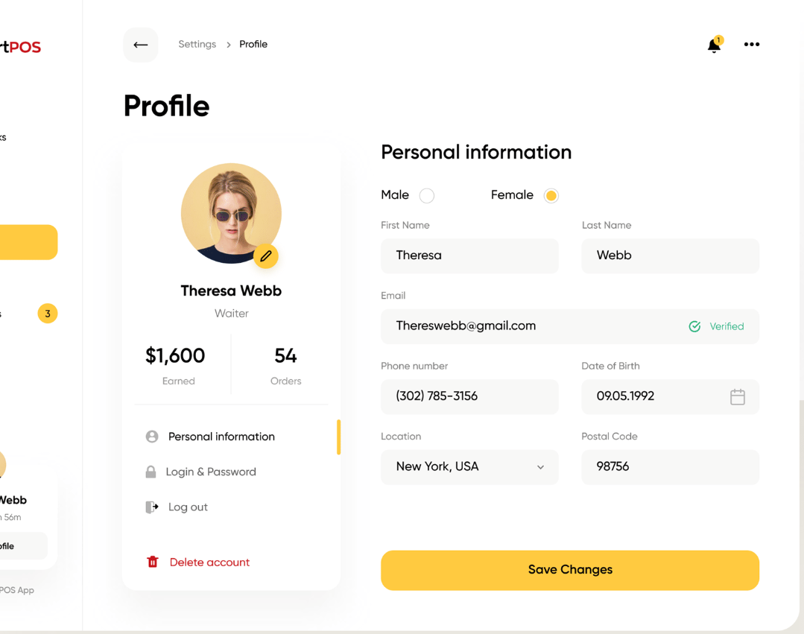
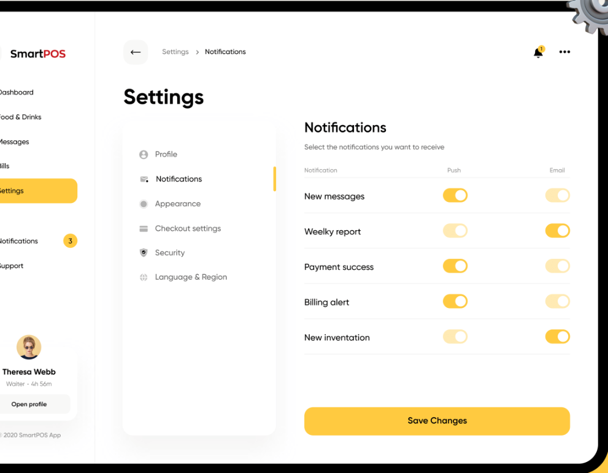
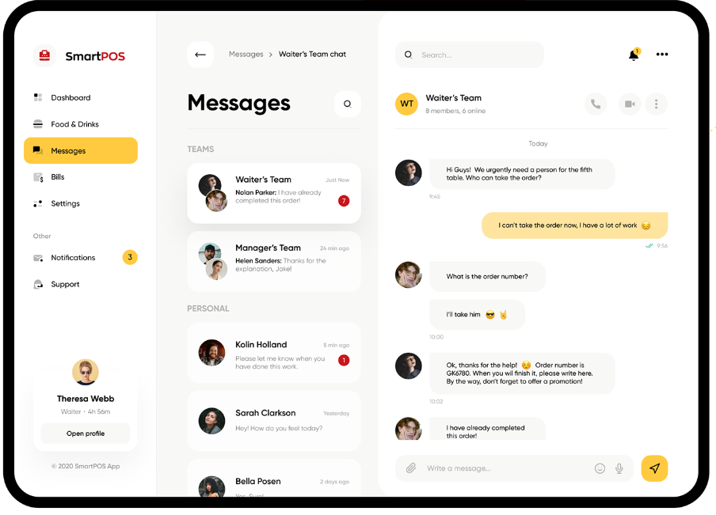

# Proyecto practica de css y html
## Contribuidores
- vivelamusicaalmaximo (page foods)
- 54albert54  (page bills)
- emanuel006 (page profile)
- Javier02R (messages)
- zknot ( settings )
## Descripcion
Este proyecto es una practica de css y html, en el cual se implementa una pagina web de hamburguesas, en la cual se puede ver el menu, pedir hamburguesas, ver el perfil de usuario, ver las facturas, ver los mensajes, y configurar la cuenta de usuario.
## Guia de colaboracion al proyecto (pull request)
Si tienes conocimientos en git puedes crear una rama en tu propio fork(copia) del repositorio y trabajar en ella, luego puedes hacer un pull request al repositorio original para que tus cambios sean revisados y aceptados.

**Pero** si no tienes conocimientos en el uso de git y deseas contribuir al repositorio sin crear ramas en tu propio fork(copia), puedes seguir estos pasos:

1. **Fork el Repositorio**: Ve al repositorio del cual deseas hacer el pull request y haz clic en el botón "Fork" en la esquina superior derecha. Esto creará una copia del repositorio en tu propia cuenta de GitHub.

2. **Clona tu Repositorio**: En tu cuenta, ve al repositorio que acabas de bifurcar (fork) y haz clic en el botón "Code". Copia la URL del repositorio (generalmente comienza con "https://github.com/tu-usuario/...") y clónalo en tu máquina local usando Git. Puedes usar el siguiente comando:

   ```
   git clone https://github.com/tu-usuario/repo-forked.git
   ```

3. **Realiza Cambios Directamente en `main`**: En lugar de crear una nueva rama, puedes trabajar directamente en la rama `main` (o `master` dependiendo del repositorio) de tu repositorio clonado.

4. **Realiza Commits Locales**: Realiza los cambios que deseas en tu repositorio local y realiza commits para guardar tus cambios:

   ```
   git add .
   git commit -m "Descripción de los cambios"
   ```

5. **Actualiza tu Repositorio en GitHub**: Sube tus cambios a tu repositorio en GitHub:

   ```
   git push origin main
   ```

6. **Crea el Pull Request**: Luego, visita el repositorio original al que deseas contribuir y selecciona la rama principal (`main` o `master`). Aparecerá un banner que te permitirá comparar y crear un pull request directamente desde la rama `main` de tu repositorio.

   Asegúrate de proporcionar una descripción detallada de tus cambios y haz clic en el botón "Create Pull Request" para enviar tu solicitud de extracción.

Recuerda ser claro y conciso en la descripción de tu pull request y estar preparado para responder a cualquier comentario o solicitud de cambios por parte del propietario del repositorio original.


## Guia de diseño de las rutas de la aplicacion

### Interfaz de la pagina perfil de usuario


### Interfaz de la pagina de configuracion


### Interfaz de la pagina de bills


### Interfaz de la pagina de messages


### Interfaz de la pagina de comida(hamburguesas)


### Guia de estilos y tipografia

